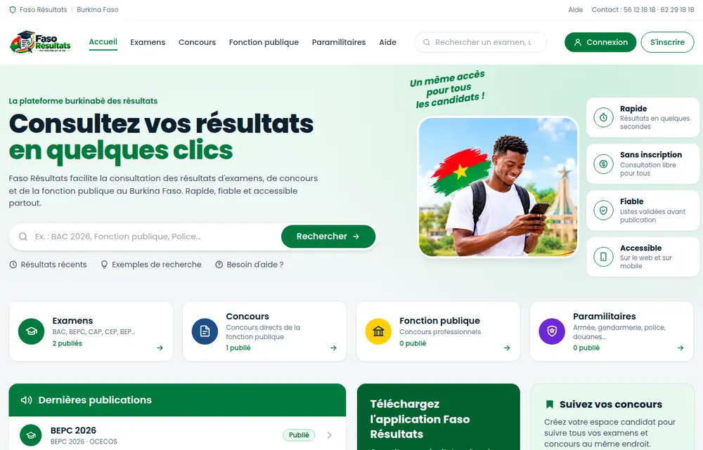
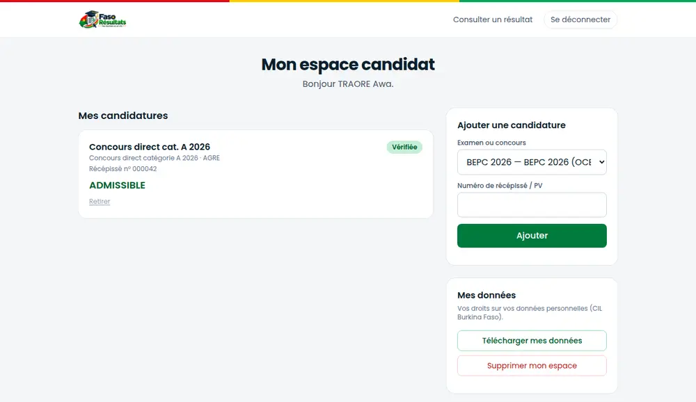
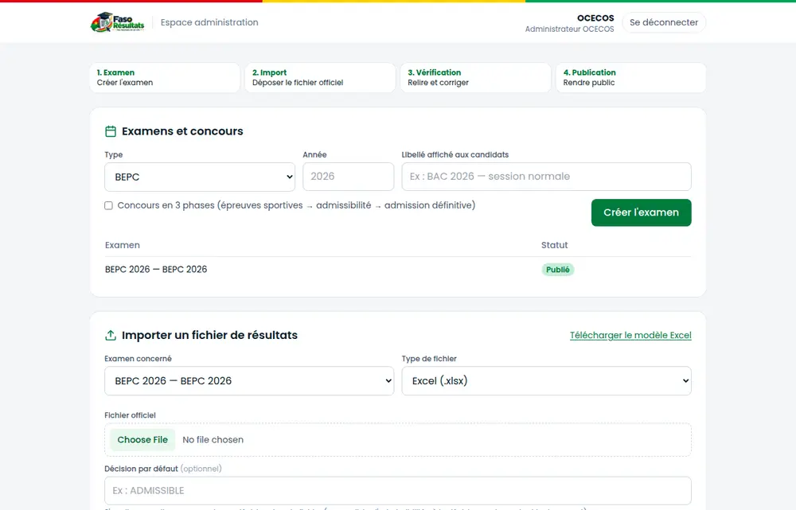

# Faso Résultats

**La plateforme burkinabè des résultats d'examens et de concours.**
*Vos résultats en un clic.*

Faso Résultats permet aux **administrations burkinabè** (OCECOS, Office du BAC,
ministères, AGRE…) de publier leurs résultats d'examens et de concours, et aux
**candidats** de les consulter simplement par numéro de PV — sur le web, sur
l'application mobile, et demain par SMS et USSD.

Chaque administration dispose de son propre espace isolé : elle importe ses
listes officielles (Excel ou PDF, y compris scannés), les **vérifie ligne par
ligne**, puis les publie sous sa propre responsabilité. Les candidats, eux,
consultent sur un portail unique.

<p align="center">
  
</p>

> Projet porté par **LUPORA Group** (Ouagadougou). Périmètre : Burkina Faso
> uniquement. Le CEP est hors périmètre (couvert par SIGEC-CEP).

---

## Sommaire

1. [Fonctionnalités](#fonctionnalités)
2. [Aperçu](#aperçu)
3. [Architecture et technologies](#architecture-et-technologies)
4. [Démarrer en local (Docker)](#démarrer-en-local-docker)
5. [Développer sans Docker](#développer-sans-docker)
6. [Application mobile](#application-mobile)
7. [Styles du site web](#styles-du-site-web)
8. [Tests et intégration continue](#tests-et-intégration-continue)
9. [Mise en production](#mise-en-production)
10. [Sécurité et données personnelles](#sécurité-et-données-personnelles)
11. [Structure du dépôt](#structure-du-dépôt)
12. [Documentation](#documentation)
13. [État du projet](#état-du-projet)

---

## Fonctionnalités

### Pour les candidats

- **Consulter un résultat sans compte** : choisir l'examen, saisir son numéro de
  PV (et son jury si besoin) — web et mobile.
- **Concours en plusieurs phases** (police, gendarmerie, douanes…) : une frise
  montre la situation à chaque phase. « Vous ne figurez pas sur la liste » n'est
  affiché **qu'une fois la phase clôturée** par l'administration, jamais avant.
- **Espace candidat** (facultatif) : suivre tous ses examens et concours au même
  endroit, connexion par code SMS, résultats rapprochés de son identité.
- **Droits sur ses données** : télécharger toutes ses données, supprimer son
  espace à tout moment.
- **Application mobile** Android / iOS, utilisable hors connexion pour les
  résultats déjà consultés.

### Pour les administrations

- **Import des listes officielles** : Excel, PDF texte, PDF scanné
  (reconnaissance de caractères en français), modèle Excel fourni.
- **Validation humaine obligatoire** : aperçu, correction ligne par ligne,
  publication explicite. Les écarts détectés dans un fichier (ex. nombre de
  lignes lues différent du nombre annoncé) doivent être **confirmés** avant
  publication, et cette confirmation est journalisée.
- **Publication par phase**, clôture de phase, publication groupée d'un examen
  (ex. jour de proclamation du BAC).
- **Traçabilité** : chaque résultat est rattaché à son fichier source ; journal
  d'audit des actions sensibles.

### Pour la plateforme

- **Multi-administrations** : chaque administration ne voit que ses propres
  données ; un super-admin gère les administrations clientes.
- **API B2B** (fondation) : accès des partenaires par clé API avec quota.
- **Tenue en charge** : cache Redis, limitation du nombre de requêtes par
  visiteur, pages légères pour la 3G.

---

## Aperçu

| Espace candidat (web) | Espace administration (web) |
|:---:|:---:|
|  |  |

| Application mobile — accueil | Application mobile — concours par phases |
|:---:|:---:|
|  |  |

---

## Architecture et technologies

```
Candidats (web · mobile · SMS/USSD à venir)        Agents des administrations
                 │                                            │
                 └──────────────► nginx (HTTPS) ◄─────────────┘
                                 │        │
                       pages web │        │ /api
                                          ▼
                                 API FastAPI ──► Redis (cache, limitation)
                                          │
                                          ▼
                                     PostgreSQL
                                          ▲
                         Import : Excel · PDF · PDF scanné (OCR)
```

| Couche | Technologie |
|--------|-------------|
| API | Python 3.11, FastAPI, SQLAlchemy 2.0, Alembic, Pydantic v2 |
| Base de données | PostgreSQL 15+ |
| Cache et limitation de débit | Redis (repli en mémoire), slowapi |
| Import de fichiers | openpyxl, pdfplumber, pytesseract + OpenCV (OCR français) |
| Authentification | JWT ; mots de passe bcrypt ; code SMS pour les candidats |
| Site web | HTML/CSS/JS sans framework, CSS Tailwind pré-généré, aucune ressource externe |
| Application mobile | Flutter (Android et iOS), Riverpod, go_router |
| Déploiement | Docker Compose, nginx, Let's Encrypt |

Détail technique complet : [`docs/ARCHITECTURE.md`](docs/ARCHITECTURE.md).

---

## Démarrer en local (Docker)

**Prérequis** : Docker et Docker Compose.

```bash
git clone <url-du-depot> faso-resultats
cd faso-resultats

# 1. Configuration locale (jamais commitée)
cp backend/.env.example backend/.env
# Générer la clé de chiffrement obligatoire et la coller dans CANDIDAT_ENCRYPTION_KEY :
python3 -c "from cryptography.fernet import Fernet; print(Fernet.generate_key().decode())"

# 2. Démarrer
docker compose up --build -d

# 3. Créer les tables puis charger les données de démonstration
docker compose exec backend alembic upgrade head
docker compose exec backend python seed.py
```

| Service | Adresse |
|---------|---------|
| Site public | http://localhost:8080 |
| Espace candidat | http://localhost:8080/candidat.html |
| Espace administration | http://localhost:8080/admin.html |
| Documentation de l'API | http://localhost:8000/docs |

**Depuis un téléphone** sur le même Wi-Fi : `http://<adresse IP du PC>:8080`
(nginx transmet `/api` au backend, comme en production).

### Comptes de démonstration (créés par `seed.py`)

| Compte | Identifiant | Mot de passe |
|--------|-------------|--------------|
| Super-admin plateforme | `superadmin@faso-resultats.bf` | `ChangeMe123!` |
| Admin OCECOS | `admin@ocecos.bf` | `ChangeMe123!` |
| Admin Office du BAC | `admin@office-bac.bf` | `ChangeMe123!` |
| Admin AGRE | `admin@agre.bf` | `ChangeMe123!` |
| Candidats | téléphones `+22670000001` à `+22670000003` | code SMS affiché à l'écran en développement |

⚠️ Ces comptes et données sont **fictifs** et réservés au développement :
`seed.py` ne doit **jamais** être lancé en production.

### Configuration obligatoire

L'API **refuse de démarrer** si la configuration est dangereuse :

| Variable | Rôle |
|----------|------|
| `CANDIDAT_ENCRYPTION_KEY` | Chiffrement au repos de l'identité des candidats (clé Fernet). **Sa perte rend ces données illisibles** : la conserver hors du serveur. |
| `JWT_SECRET_KEY` | Signature des sessions admin et candidat |
| `CANDIDAT_HASH_PEPPER`, `API_KEY_PEPPER` | Secrets des empreintes de recherche (CNIB, téléphone) et des clés API |

En production (`ENVIRONMENT=production`), une valeur de développement
(`change-me-in-production`) est refusée au démarrage. Ne jamais réutiliser une
clé entre environnements, ne jamais commiter un vrai secret.

---

## Développer sans Docker

```bash
cd backend
python3 -m venv .venv && source .venv/bin/activate
pip install -r requirements.txt
cp .env.example .env        # puis adapter DATABASE_URL et générer CANDIDAT_ENCRYPTION_KEY
alembic upgrade head
python seed.py
uvicorn app.main:app --reload
```

L'OCR nécessite `tesseract` (avec la langue `fra`) et `poppler` installés sur
la machine, comme dans l'image Docker.

---

## Application mobile

Application Flutter dans [`mobile/`](mobile/) — procédure complète (émulateur,
téléphone physique, iOS) dans [`mobile/README.md`](mobile/README.md).

```bash
cd mobile
flutter pub get
flutter run --dart-define=API_BASE_URL=http://<adresse IP du PC>:8000
```

Publication sur les stores (clé de signature, comptes développeur) :
[`mobile/docs/RELEASE.md`](mobile/docs/RELEASE.md).

---

## Styles du site web

Le CSS des pages (`frontend/public/css/app.css`) est **pré-généré** avec
Tailwind ; le site reste un ensemble de fichiers statiques. Après toute
modification du HTML, du JavaScript ou de `frontend/src/app.css` :

```bash
cd frontend
npm install          # une seule fois
npm run build:css    # ou : npm run watch:css pendant le développement
```

Committer `public/css/app.css` : la CI échoue s'il n'est pas à jour. Écrire
toujours les classes en entier dans le code (`"bg-red-700"`, jamais
`` `bg-${couleur}-700` ``), sinon elles manquent au CSS généré.

Identité visuelle (couleurs, police Poppins, logo) :
[`docs/CHARTE_GRAPHIQUE.md`](docs/CHARTE_GRAPHIQUE.md).

---

## Tests et intégration continue

```bash
# API (tests sur SQLite en mémoire, couverture minimale 60 %)
cd backend && pytest
ruff check . && black --check .

# Application mobile
cd mobile && flutter analyze && flutter test
```

Trois chaînes d'intégration continue (`.github/workflows/`) se déclenchent à
chaque push :

| CI | Vérifie |
|----|---------|
| Backend CI | ruff, black, pytest avec couverture, migrations sur un vrai PostgreSQL (aller-retour complet) |
| Mobile CI | format, analyse, tests, builds APK debug et release |
| Frontend CI | CSS à jour, syntaxe JS, aucune ressource externe, configuration nginx de production valide |

---

## Mise en production

Guide pas à pas, testé de bout en bout : **[`docs/DEPLOIEMENT.md`](docs/DEPLOIEMENT.md)**.

En résumé : un serveur avec Docker, un nom de domaine, puis

```bash
cp deploy/production.env.example deploy/production.env   # remplir tous les secrets
# certificat HTTPS (Let's Encrypt), puis :
docker compose -f docker-compose.prod.yml --env-file deploy/production.env up -d --build
docker compose -f docker-compose.prod.yml --env-file deploy/production.env \
  run --rm backend python creer_super_admin.py
```

Le guide couvre aussi le renouvellement du certificat, les sauvegardes (et leur
restauration), la purge réglementaire des données et les mises à jour.

---

## Sécurité et données personnelles

- Identité des candidats (CNIB, date de naissance, téléphone) **chiffrée** en
  base ; aucune liste de candidats consultable (il faut un numéro de PV précis).
- Limitation du nombre de requêtes par visiteur ; verrouillage des comptes après
  échecs de connexion ; journal d'audit.
- En production : HTTPS obligatoire, politique de sécurité du contenu stricte,
  seul le serveur web exposé, journaux plafonnés.
- Conformité à la réglementation burkinabè (CIL) : [`docs/CIL.md`](docs/CIL.md)
  et [`docs/CIL_PROFIL_CANDIDAT.md`](docs/CIL_PROFIL_CANDIDAT.md) ; pages
  publiques [confidentialité](frontend/public/confidentialite.html) et
  [conditions d'utilisation](frontend/public/conditions.html).

Dernier audit complet : [`docs/AUDIT_2026-10-02.md`](docs/AUDIT_2026-10-02.md).

---

## Structure du dépôt

```
faso-resultats/
├── backend/                 API FastAPI
│   ├── app/                 routes, services (import, phases, candidats), modèles
│   ├── alembic/             migrations de la base
│   ├── tests/               tests pytest
│   ├── seed.py              données de démonstration (développement uniquement)
│   ├── creer_super_admin.py premier compte en production
│   └── purge_candidats.py   purge réglementaire quotidienne
├── frontend/
│   ├── public/              site web servi tel quel (HTML, JS, CSS généré, polices)
│   └── src/app.css          source du CSS (Tailwind)
├── mobile/                  application Flutter
├── deploy/                  production : nginx, modèle de configuration, sauvegarde
├── docs/                    documentation (voir ci-dessous)
├── docker-compose.yml       environnement de développement
└── docker-compose.prod.yml  environnement de production
```

---

## Documentation

| Document | Contenu |
|----------|---------|
| [`docs/ARCHITECTURE.md`](docs/ARCHITECTURE.md) | Architecture technique, modèle de données, choix structurants |
| [`docs/DEPLOIEMENT.md`](docs/DEPLOIEMENT.md) | Mise en production pas à pas |
| [`docs/ROADMAP.md`](docs/ROADMAP.md) | Phases du projet, décisions et prérequis |
| [`docs/CONTEXTE_METIER.md`](docs/CONTEXTE_METIER.md) | Examens et concours du Burkina Faso, acteurs, concurrence |
| [`docs/PIVOT_SAAS_B2G.md`](docs/PIVOT_SAAS_B2G.md) · [`docs/MULTI_TENANCY.md`](docs/MULTI_TENANCY.md) | Positionnement auprès des administrations, isolation entre elles |
| [`docs/PROFIL_CANDIDAT_UNIFIE.md`](docs/PROFIL_CANDIDAT_UNIFIE.md) | Espace candidat et vérification d'identité |
| [`docs/CIL.md`](docs/CIL.md) · [`docs/CIL_PROFIL_CANDIDAT.md`](docs/CIL_PROFIL_CANDIDAT.md) | Protection des données personnelles |
| [`docs/CHARTE_GRAPHIQUE.md`](docs/CHARTE_GRAPHIQUE.md) | Identité visuelle |
| [`docs/PARSER_PDF_FONCTION_PUBLIQUE.md`](docs/PARSER_PDF_FONCTION_PUBLIQUE.md) | Lecture des communiqués scannés |
| [`docs/AUDIT_2026-10-02.md`](docs/AUDIT_2026-10-02.md) | Dernier audit complet |
| [`CLAUDE.md`](CLAUDE.md) | Principes du projet et historique des décisions |

---

## État du projet

| Phase | Contenu | Statut |
|-------|---------|--------|
| 1 | API, import, site public, administration | ✅ Terminée |
| 2 | SMS (notifications, consultation) | 🔒 En attente du contrat opérateur |
| 3 | Application mobile ; espace établissement | 🟡 Application bien avancée ; espace établissement à faire |
| 4 | USSD ; API B2B | 🟡 Fondation API B2B en place ; USSD en attente du contrat opérateur |

Prochaines étapes et prérequis (hébergement, structure juridique, démarches
CIL et ANSSI) : [`docs/ROADMAP.md`](docs/ROADMAP.md).

**Contact** : 56 12 18 18 · 62 29 18 18
